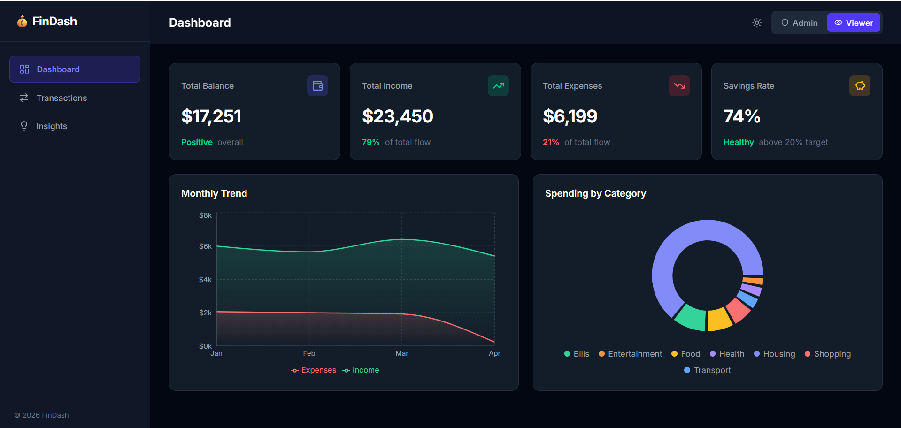
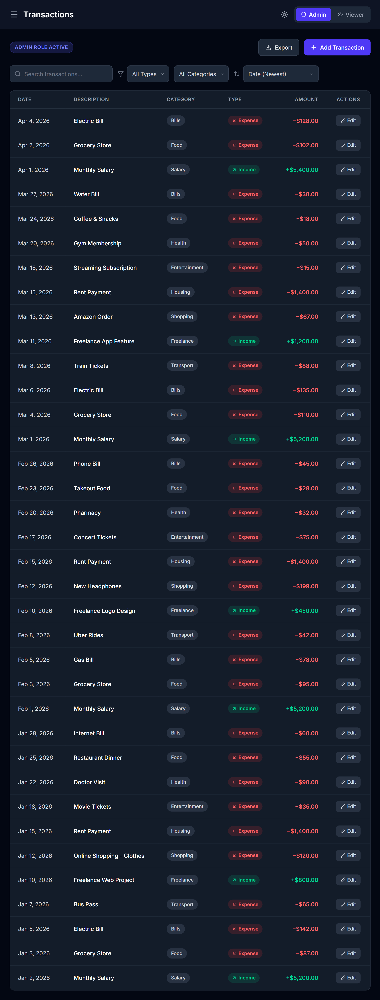
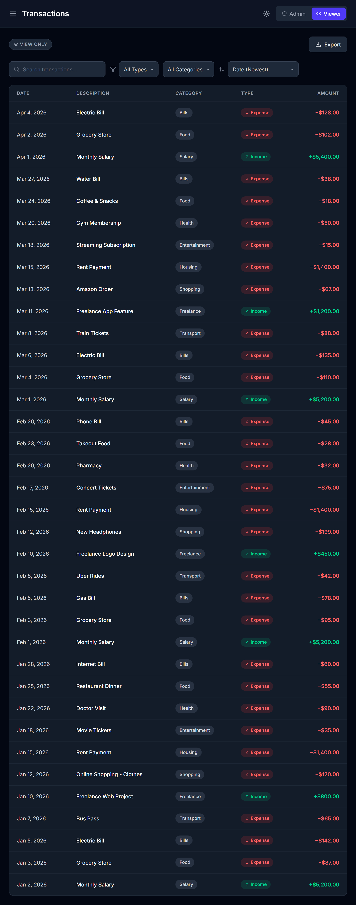
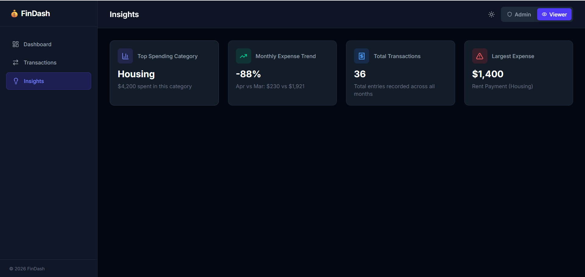

# Finance Dashboard

##  Overview
This project is a Finance Dashboard that allows users to track their income and expenses, view insights, and analyze spending patterns through charts and summaries.

The dashboard allows users to:
- view financial summary
- see transaction
- understand spending patterns
- Switch between Viewer and Admin roles

---

## 🌐 Live Demo
https://bhushan0455.github.io/FinanceDashboard/

##  Tech Stack
- React (with Vite)
- Tailwind CSS
- Recharts (for charts)
- Lucide React (icons)
- GitHub Pages (deployment)

---
## 📸 Screenshots

### Dashboard


### Transactions



### Insights Section


##  Features
- Dashboard with summary cards (Income, Expenses, Balance)
- Charts for:
  - Monthly trends
  - Category-wise spending
- Transactions table with:
  - Search
  - Filtering
  - Sorting
- Role-based UI:
  - Admin → can add/edit transactions
  - Viewer → read-only
- Data stored using localStorage
- Responsive UI (works on different screen sizes)

---

##  Role-Based UI
This project includes a simple role system:

- **Admin**
  - can add and edit transactions
- **Viewer**
  - can only view data

This is only simulated on frontend (no backend).

---

##  State Management
I used basic React concepts for state management:
- `useState` for UI and data
- `useMemo` for filtering and calculations
- LocalStorage to save data

I avoided using Redux or other libraries to keep things simple.

---

##  Assumptions
- No backend was required for this assignment
- Mock data is used initially
- All logic is handled on frontend
- Modern browser is assumed

---

##  Extra Features Added
- Dark mode toggle
- Data persistence using localStorage
- Export transactions feature

---
##  Setup Instructions & How to Run Locally

### Prerequisites
Make sure you have [Node.js](https://nodejs.org/) installed on your machine.

### Installation
1. Clone the repository or extract the zip file:
   ```bash
   git clone https://github.com/Bhushan0455/FinanceDashboard.git
   cd FinanceDashboard
   ```

2. Install the necessary dependencies:
   ```bash
   npm install
   ```

### Running the Application
To start the local development server:
```bash
npm run dev
```
Open your browser and navigate to the URL provided in the terminal (usually `http://localhost:5173/`).

### Building for Production
To generate a minified production build:
```bash
npm run build
```

---


